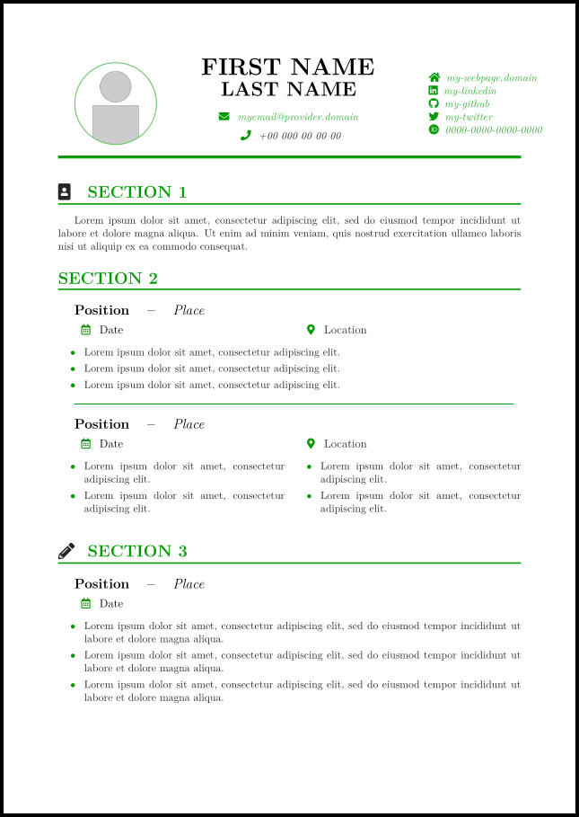

# CV/Résumé Latex class

This is a CV class I create only for educational purposes. If you would like to use something 'fancier', then you should check [altacv](https://github.com/liantze/AltaCV), which I took as a reference when creating this class.


## Sample



---
## Compilation and Requirements

You will need `pdflatex` or `xelatex` to compile this class.

This class use the next packages, so make sure you have them installed in the environment you use:
- xcolor
- geometry
- graphicx
- xparse
- dashrule
- hyperref
- fontawesome5
- tikz
- enumitem
- etoolbox


### Sites group

You can use these macros to set a link to your favourite sites. Ke

```latex
\CVSitesInfo{
  \WebPage{my-webpage.domain}  % 'https://my-webpage.domain'
  \LinkedIn{my-linkedin}       % 'https://linkedin.com/in/my-linkedin'
  \GitHub{my-github}           % 'https://github.com/my-github'
  \Twitter{my-twitter}         % 'https://twitter.com/my-twitter'
  \Orcid{0000-0000-0000-0000}  % 'https://orcid.org/0000-0000-0000-0000'
}
```

### Styling

#### Colors

There is a lot of colors you can use, both in the header...

- `CVBodyColor`
- `CVFirstNameColor`
- `CVLastNameColor`
- `CVEmailTextColor`
- `CVEmailIconColor`
- `CVPhoneTextColor`
- `CVPhoneIconColor`
- `CVSitesTextColor`
- `CVSitesIconsColor`
- `CVHeaderRuleColor`

... and also in the body.

- `CVSectionHeaderTitleColor`
- `CVSectionHeaderSecondaryColor`
- `CVSectionHeaderRuleColor`
- `CVItemMainColor`
- `CVItemSeparatorColor`
- `CVItemSecondaryColor`
- `CVItemCalendarIconColor`
- `CVItemCalendarTextCoor`
- `CVItemLocationIconColor`
- `CVItemLocationTextColor`
- `CVItemRuleDividerColor`

You can use `\definecolor` and `\colorlet` to define these colors.

---

#### Fonts

Same with fonts. Header:
```latex
\CVFirstNameFont{\normalsize}
\CVLastNameFont{\normalsize}
\CVPhoneFont{\normalsize}
\CVEmailFont{\normalsize}
\CVSitesFont{\normalsize}
```

Body:
```latex
\CVSectionHeaderTitleFont{\normalsize}
\CVSectionHeaderSecondaryFont{\normalsize}
\CVItemMainFont{\normalsize}
\CVItemSeparatorFont{\normalsize}
\CVItemSecondaryFont{\normalsize}
\CVItemTertiaryFont{\normalsize}
```

---

And there is more, check it in the [sample.tex](https://github.com/rodrigo-vb/cv-latex/blob/master/sample.tex) file (there is more info there).
